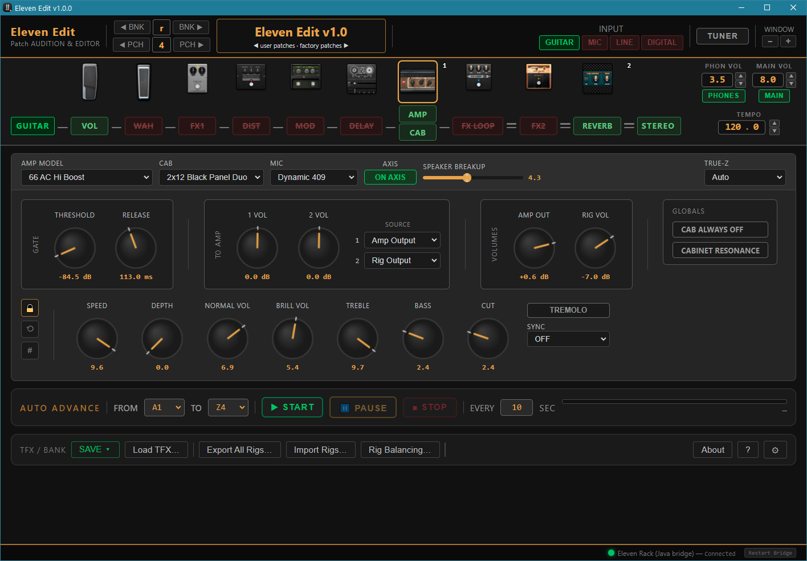

# Eleven Edit

A free rig editor and librarian for the Avid Eleven Rack, controlled from your
computer over USB/MIDI. No iLok and no Avid Eleven Rack Editor required —
just the Avid USB driver and a connected Eleven Rack.

> **Status:** v1.1.0 — released to the Eleven Rack community, as-is. See the
> disclaimer below and **always back up your unit before loading banks.**



## What it does

- Browse, edit, and organize the rigs on your Eleven Rack — live knob and
  effect-panel editing that mirrors the hardware, patch navigation with a
  jump-to-any-slot/by-name list, and inline renaming.
- Save edits to any rack slot or to disk as a `.tfx` file; load a `.tfx`
  back in for further editing.
- Back up all 104 user/factory slots to disk in one pass, and restore from
  a backup with a full preview of what will change before anything is
  written.
- A dedicated Rig Balancing screen for leveling output volume across every
  user rig, with buffered edits you can discard cleanly if you change your
  mind partway through.
- An Auto Advance mode for hands-free auditioning of a whole bank.

## Architecture

Eleven Edit is an Electron desktop app. A small Java WebSocket bridge
(`ElevenRackBridge.jar`) owns all MIDI hardware access via `javax.sound.midi`;
the Electron renderer talks to it over `ws://localhost:57121`. The app does
**not** run on the Eleven Rack — it remote-controls the hardware over MIDI.

Built with [Claude Code](https://www.anthropic.com/claude-code), Anthropic's AI
coding assistant.

## Requirements

- An Avid Eleven Rack connected over USB.
- The Avid Eleven Rack USB driver installed. For **patch editing**, Eleven Edit
  talks through the operating system's MIDI layer, so it is driver-version-
  agnostic — **v1.1.12 or v1.0.11** both work, and the Avid Eleven Rack Editor
  itself is not needed, just its driver. (The optional built-in **audio engine**
  is fussier about ASIO — see *A note on ASIO on Windows* below; driver **1.1.11**
  is preferred for ASIO there.)
- A Java runtime for the bridge — **JRE 25 or newer required.** Older
  versions (including JRE 8 and JRE 21) have been directly tested and found to
  freeze or crash Windows when running Eleven Edit; the app checks this on
  startup and won't launch the bridge against a JRE below 25.
- **Windows 10 or Windows 11 (64-bit / x64).** The only platforms tested and
  supported today. macOS and Linux are untested; the Avid driver and this app's
  MIDI access are both Windows-only as it stands. Porting to other platforms is
  a hoped-for community contribution after open-source release, not
  something the current codebase has been adapted for yet.
- **Eleven Rack firmware Version 2.0.1, Build 0.1.5.7** — what Eleven Edit is
  built and tested against. Other firmware versions are untested; the app checks
  firmware at startup and stops if it does not match.

### The real prerequisite (and a note on Windows 11)

Eleven Edit is a *passenger*: it runs in user space on top of Windows, the Avid
USB driver, and Java, and it cannot cause a Windows crash. So the only real
prerequisite is a machine that stays stable with the Avid driver installed:
install the Avid USB driver and JRE 25/26, connect the rack, and reboot a couple
of times with it plugged in. If Windows is stable that way, Eleven Edit runs on
top of it fine. If the PC is **not** stable with just the driver installed —
before Eleven Edit is even involved — that's an Avid-driver/Windows matter to
sort out first, not an Eleven Edit one.

Windows 10 has been rock-solid throughout. Windows 11 is more prone to Avid
driver trouble in general — Avid's own Eleven Rack Editor is known not to run
(and sometimes to crash the machine) on Windows 11. Eleven Edit itself is
unaffected by the Editor's problems, but it still rides on the same USB driver,
so if a Windows 11 machine is unstable with the driver installed: keep the Eleven
Rack off the Windows **default sound device** role, or use the lighter 1.0.11
driver. The User Manual's Troubleshooting section has the full rundown, including
a separate Windows 11 note about bank/patch **uploads**.

### A note on ASIO on Windows

Eleven Edit v1.1.0 adds an optional built-in audio engine that passes your rig's
sound through to speakers/headphones. It can use **ASIO** (low latency) or
**WASAPI**. ASIO on Windows is powerful but famously machine-specific: whether a
given ASIO driver initializes cleanly depends on the exact driver version, your
Windows edition/build, and what other audio gear and drivers are installed — it
is not something any app fully controls, Eleven Edit included.

**If your ASIO already works, leave it alone.** If you have a Focusrite (or the
Rack itself) enumerating and passing sound the way you like, you fought this
battle already and won — don't change drivers chasing a "better" setup.

**If ASIO is empty, won't start, or "just vanished,"** the most common cause is
the Avid Eleven Rack **1.1.12** "final" driver, which fails to start ASIO on many
modern Windows setups — and can take other older ASIO drivers down with it on the
same PC. Things worth trying, roughly in order:

1. Roll the Avid driver back to **1.1.11**.
2. Remove other dead/legacy ASIO drivers you don't use.
3. Reboot, then rescan in **Audio Setup**.

One of these usually brings it back — but there is no promise which, because every
machine's audio stack is a little different.

**When ASIO fights you, use WASAPI.** In Audio Setup, switch *Device Type* to
WASAPI — it sidesteps the ASIO driver mess entirely. Latency is a touch higher,
but for monitoring your rig it is perfectly usable and it "just works" far more
often.

None of this is unique to Eleven Edit — a broken ASIO stack breaks every audio app
the same way (the Rack's ASIO failures reproduce in other hosts such as Reaper).
Eleven Edit just gives you WASAPI as a no-drama alternative. This is the same
family of "the Avid driver, not Eleven Edit" caveats as the Windows-stability note
above.

## Known limitations

- **Expression Pedal / Footswitch jack.** The rear Expression Pedal / Footswitch
  jack still works normally on the rack — Eleven Edit just can't configure it.
  Set it up the way you always have (front panel, or Avid's own editor if you can
  run it); those methods are unaffected.
- **No Pro Tools integration.** Eleven Edit is a standalone editor, not a plugin,
  and doesn't tie into Pro Tools sessions.

Both come down to the same thing: the author doesn't have the hardware/setup to
reverse-engineer and test them safely. They may come in a later build;
contributions are welcome.

## Build

Build from source:

```
npm install
npm run build
```

This produces a Windows installer (`.exe`) in the `dist` folder via
electron-builder. Run it — it'll show a license/terms screen, check for
a working Java runtime, and install Eleven Edit like any other Windows
app.

### Building the Java bridge

`npm run build` bundles a prebuilt `ElevenRackBridge.jar` but does **not**
compile it. The jar is a build artifact and is not committed to the repo
(only the source, `ElevenRackBridge.java`, is). Compile it once, from the
repo root, with **JDK 25 or newer**:

```
javac ElevenRackBridge.java
jar --create --file ElevenRackBridge.jar --main-class ElevenRackBridge ElevenRackBridge*.class
```

This writes `ElevenRackBridge.jar` in the repo root, where `npm run build`
picks it up. The intermediate `*.class` files can be deleted afterwards.

## Startup flags

- `/LOGS` — enable session logging.
- `/NOGPU` — force software rendering (for VMs that hit a splash-screen
  white-flash bug; not needed on real hardware).

## Safety / disclaimer

Free to use and share under the MIT License, with **no warranty, express or
implied — use at your own risk.** Always back up your unit before loading new
banks. The author is not responsible for lost patches, corrupted banks, or gear
that mysteriously starts playing better than you can.

## Acknowledgments

Eleven Edit was written independently, from scratch — no third-party source code
is included or reused. The Eleven Rack USB/MIDI (SysEx) protocol was re-derived
here through direct packet analysis; no Avid software, firmware, or source code
was used.

The SysEx protocol map builds on, and gratefully acknowledges, the earlier
reverse-engineering work of **Guillaume Schmid — [ElevenHack](https://sites.google.com/site/elevenhack/)
(released 2013; open-sourced 2020 under the Apache License 2.0)**. ElevenHack
was consulted as conceptual reference only — it was the clue that Java's
`javax.sound.midi` exposes the Eleven Rack's Vendor-Specific transport that
Windows otherwise hides. None of its code was copied or ported.

If you build on Eleven Edit, please keep **Charles Wardick** and **Guillaume
Schmid** named in your credits, passing the courtesy forward. (A request, not a
license condition.)

See [`NOTICE`](NOTICE) for the full acknowledgment.

## License

[MIT](LICENSE) © 2026 Charles Wardick

---

*Eleven Rack is a trademark of its respective owner. Eleven Edit is an
independent, unofficial project and is not affiliated with or endorsed by Avid.*
